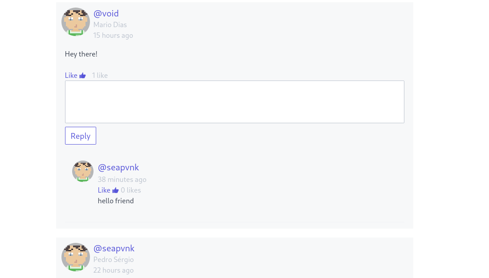
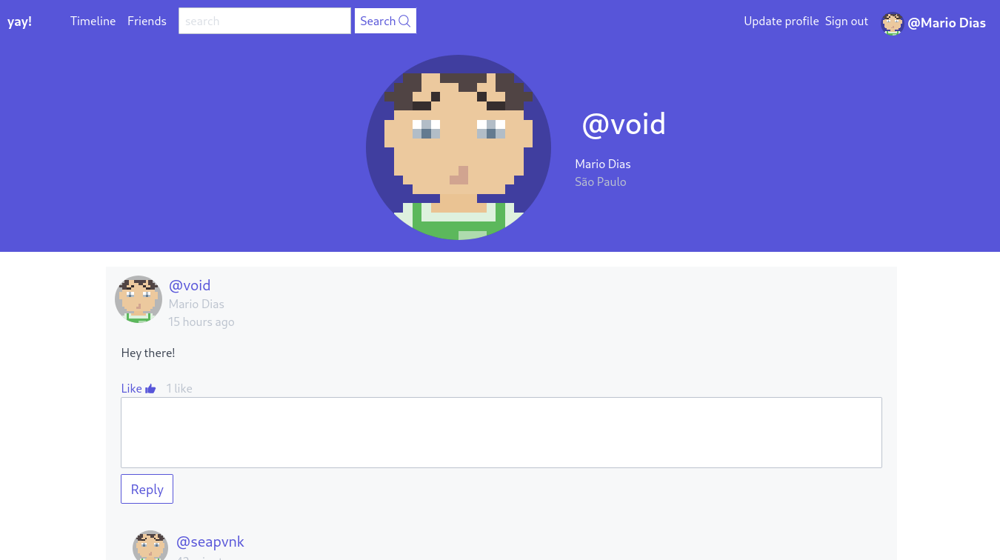

# Yay
A social network build with Laravel

## Screenshots

   
   
   

## Techlogies
Yay is built mainly with Laravel framework for backend and templates generation and CSS for apply styles.

- PHP
- Laravel
- CSS
- JS

## Roadmap
- [x] Refactor views
- [ ] Add profile picture feature
- [ ] Add profile cover feature
- [x] Redesign interface to a better one
- [ ] Ajax requests for add friends and like statuses
